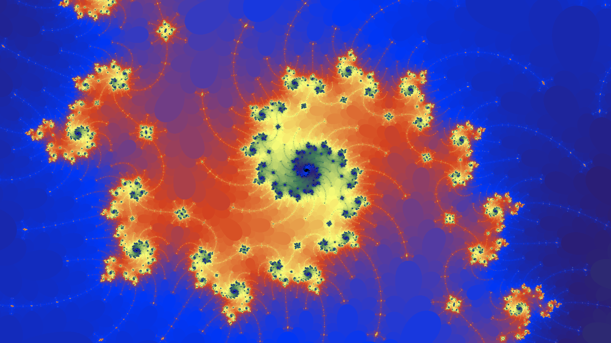
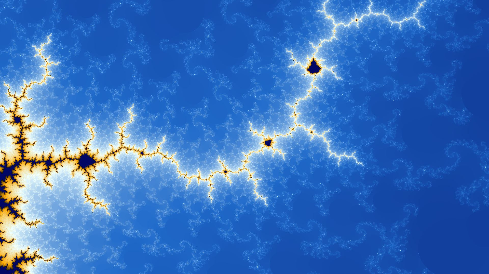
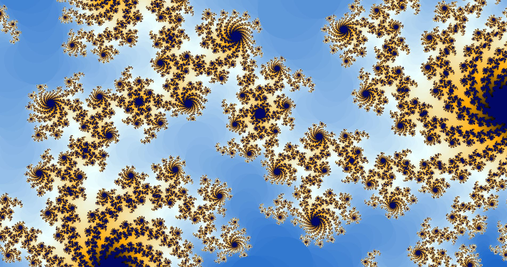

# Mandelbrot interactive fractal set using SFML 2.5

Most popular fractal revisited with C++ and SFML 2.5 for SPA class Assigment





## Installation

Follow the tutorial at [SFML](https://www.sfml-dev.org/tutorials/2.5/start-vc.php) to install SFML 2.5 32bit and run at x86!.

## Usage

- W|A|S|D to move around 
- Mouse wheel to zoom in and out 
- R to restart
- E to save image

To chage the preset colors edit colorsPresets at GameState.h
```c++

	//color presets
	const std::vector<sf::Color> colorsPreset1{
	{0, 0, 1},
	{25, 7, 26},
	{9, 1, 47},
	{4, 4, 73},
	{0, 7, 100},
	{12, 44, 138},
	{24, 82, 177},
	{57, 125, 209},
	{134, 181, 229},
	{211, 236, 248},
	{241, 233, 191},
	{248, 201, 95},
	{255, 170, 0},
	{204, 128, 0},
	{153, 87, 0},
	{106, 52, 3}
	};

```


## License
[MIT](https://choosealicense.com/licenses/mit/)